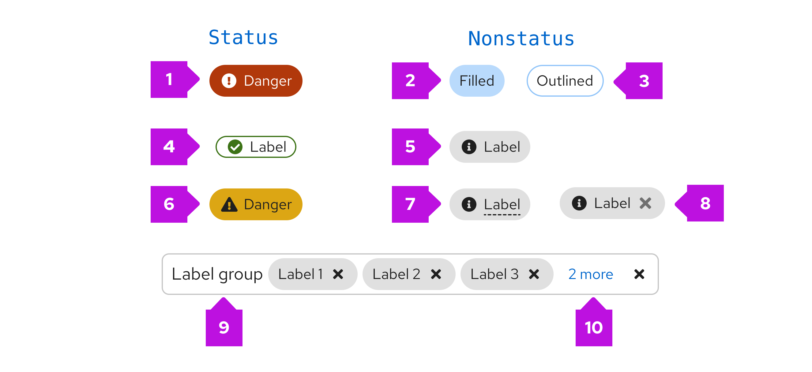
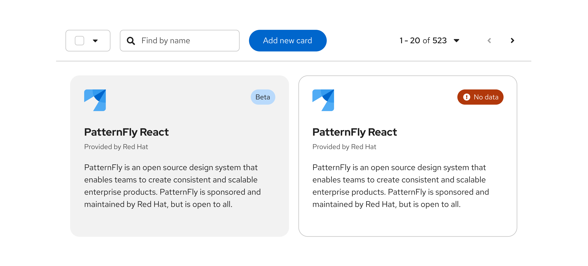
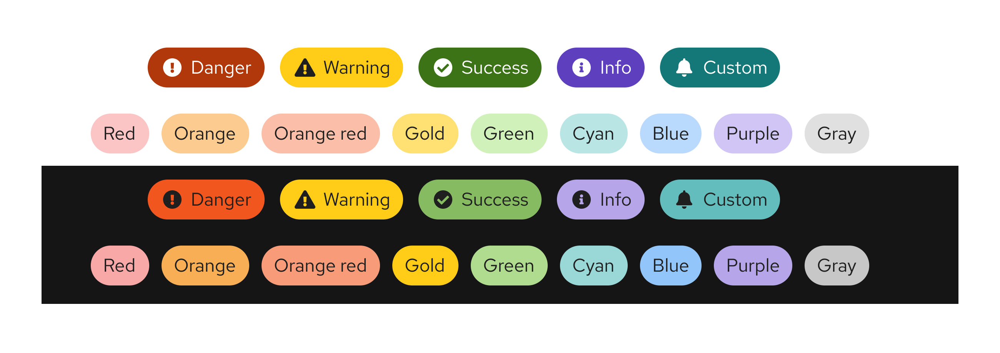
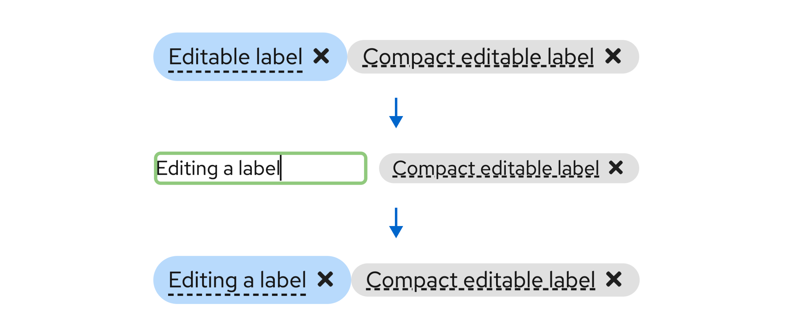
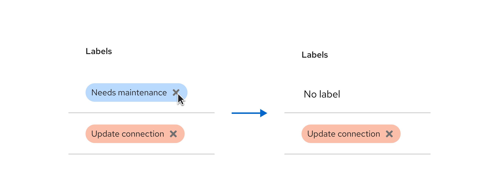
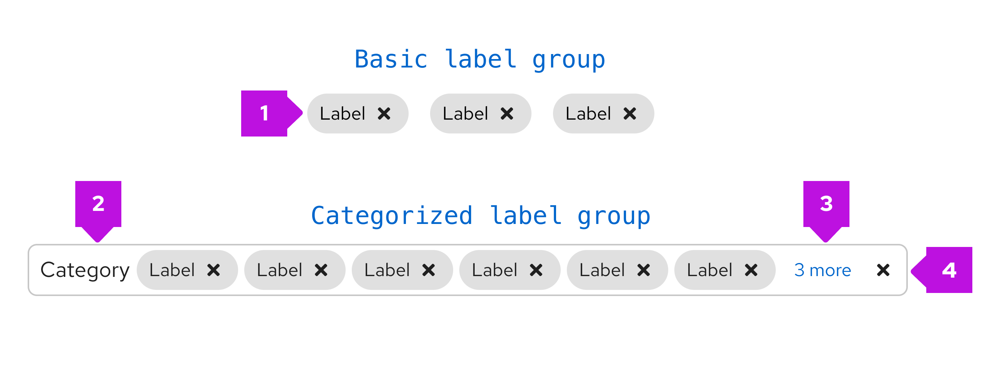

## Labels

### Elements
You can further customize labels by adjusting their visual styling or adding functionality to let user click, edit, or remove labels.

1. **Status label:** Combines color and an icon to communicate a status, like danger, warning, or success.
1. **Filled label:** Can be used for additional emphasis.
1. **Unfilled label:** Can be used as a less prominent label style.
1. **Compact label:** Takes up less space than the default label.
1. **Label with icon:** Can utilize a recognizable icon to make the label more clear and identifiable. 
1. **Clickable label:** Is identified by the inclusion of a hover state (as shown in the example image).
1. **Editable label:** Is identified by a dashed underline.
1. **Dismissible label:** Can be removed or dismissed by clicking on the "x" close icon.
1. **Label group:** Contains multiple labels at once.
1. **Overflow label** Contains additional labels that don't fit within the main space of the label group.

### Usage

Labels are useful in a few scenarios: 
- When you want to highlight an element on a page to draw attention to it or make it more searchable. 
- To tag items of the same category. If you want to show a count, use a [badge](/components/badge) instead.
- For use in [filtering](/patterns/filters) to indicate user selections, similar to the now deprecated [chip](/component/chip) component.

There are 2 label sizes:

1. **Default labels:** Use by default when needing a label.
2. **Compact labels:** Use when confronted by space limitations and a smaller label is required (for example, in a table).

Labels can be used almost anywhere in a UI. They are commonly used in tables, card views, and filters.

**Labels in tables:**

    

**Labels in card views:**

    

**Labels in filters**

    

#### Color considerations

Labels can utilize both our [status](/design-foundations/colors#status-and-state-colors)  and [nonstatus](/design-foundations/colors#nonstatus-colors) color palettes.

While you may use other colors for your labels, we recommend using the ones provided as they have been carefully selected to be accessible with the PatternFly library. If you choose to use other colors, be mindful of picking [accessible text color and icon color](/accessibility/testing-your-accessibility) to go with the label background.

The colors you should use differs for status and nonstatus labels:

**Status labels:**

Status colors can be used to indicate danger, warning, success, info, or custom statuses. 

    

**Nonstatus labels:** 

We offer a nonstatus color palette, which you can use to color code labels that don't correspond to any status level, including red, orange, orange red, gold, green, cyan, blue, purple, and gray. 

    

**Note:** We recommend to avoid using red, unless you're indicating danger or an error state.

### Variations
- [Filled or unfilled labels](#when-to-use-filled-or-unfilled-labels)
- [Labels with icons](#when-to-use-labels-with-icons)
- [Editable labels](#when-to-use-editable-labels)
- [dismissible labels](#when-to-use-dismissible-labels)
- [Clickable labels](#when-to-use-clickable-labels)

#### When to use filled or unfilled labels

Use the filled option to add more visual prominence to a label. If your use case requires a mix of clickable and non-clickable labels, consider using 1 type for clickable and another for non-clickable. Whatever convention you choose, be sure to maintain consistency through your UI.

Both status and nonstatus labels can be filled or unfilled.

**Filled:**

**Unfilled:**

#### When to use labels with icons

While status labels will automatically contain an appropriate icon, you can also add an icon to nonstatus labels, when additional visual information would be helpful. 

Icons can also help distinguish labels of the same color.

#### When to use editable labels
Use editable labels when you want to allow users to organize and select resources manually. Adding editable labels enables the user to query for objects that have similar, dissimilar, or overlapping labels.

#### When to use dismissible labels

Use a dismissible label for labels that can be easily removed. Editable labels are often dismissible as well.

#### When to use clickable labels
Use a clickable label for labels that trigger actions or link to new pages. 

As shown in the following image, a common use case for clickable labels is when a user may want to filter by a specific label. 

## Label groups

Label groups are used to display multiple labels at once. 

### Elements
Label groups have a number of components to them.

1. **Label:** Indicates the labels applied.
1. **Group category (optional):** Indicates the group category or name.
1. **Overflow:** Indicates if there are more labels to show.
1. **Group close (optional):** Deletes the entire label group.

You can build custom label groups using various combinations of these features.

### Usage
Label groups should be used when there are multiple labels assigned to a component. They can be used almost anywhere in a UI, but are commonly used in table views and description lists. Label groups can be oriented either horizontally or vertically and can optionally be named and be dismissible. You may also make the label group editable to allow users to edit an existing label or add a new label.

#### Label groups in a table

#### Label groups in a table popover

#### Label groups in a description list

### Variations

#### Editable label group

##### Adding a new label to a group, without a group label
This variation can be used when there is a need to add a new label or edit an existing label within a label group, and the label group does not have a group label.

When the user selects the ‘Add label’ button, a new label is added as the first label in the group. Once the new label is added, the user can overwrite the default value by double clicking the label.

##### Adding a new label to a group, with a group label
This variation can be used when there is a need to add a new label within the label group, and the label group has a group label. 

When the user selects the ‘Add label’ button, a new label is added as the first label in the group. Once the new label is added, the user can overwrite the default value by double clicking the label.

##### Adding a new label to a label group from a list of preselected labels
This variation can be used when only a fixed set of labels can be added to a label group. 

When the user selects the ‘Add label’ button, a drop list is displayed with the existing list of values. User selects a new label from the values in the drop list.

The new label is added with the selected value and can not be changed. 

##### Adding a new custom label to a label group
This variation can be used when you want to allow users to customize the labels they add to a label group. 

When the user selects the ‘Add label’ button, it opens up a modal from which they can select the attributes for the new label. These include label text, color, icon, filled vs outlined, ability to dismiss, and editability. The options shown can be customized to fit your use cases.

The new label is created based on the attributes selected by the user and it can not be changed.

## Accessibility
For information regarding accessibility, visit the [labels accessibility](/components/label/accessibility) tab.