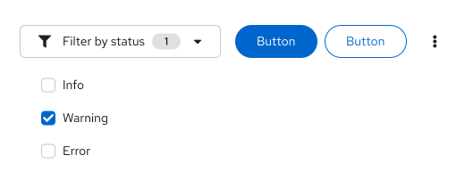
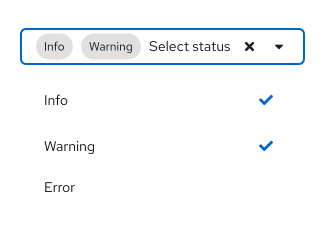
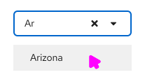
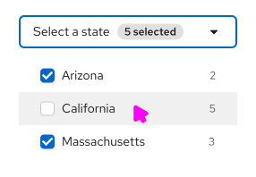
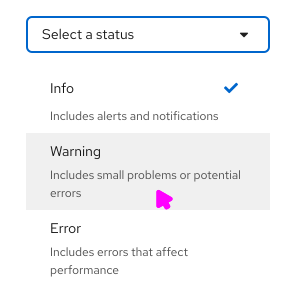
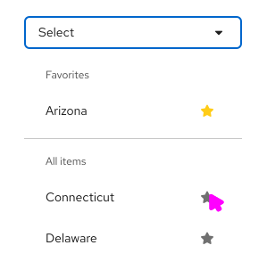
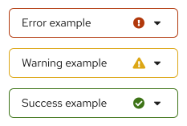

import '../components.css';

## Elements

A select component consists of a toggle control to open and close a menu of actions or links. Selects differ from [dropdowns](/components/menus/dropdown) in that they persist selection, whereas dropdowns are typically used to present a list of actions or links.

1. **Toggle:** The toggle is used to open and close the menu. It takes on all of the behaviors of a button. The toggle label always reflects the currently selected item or may hold a placeholder if nothing is selected.

2. **Menu:** The menu contains a list of options or values. For better scannability, menus should optimally present 7 items or fewer. For longer menus, items may be grouped or scrolling may be exposed by limiting the height of the menu. See the [menu component guidelines](/components/menus/menu/design-guidelines) for more information about supported options, including use of icons, grouping, and descriptions. 

## Usage

Guidance for usage varies depending on the type of select list:
* [Single select](#single-select)
* [Checkbox select](#checkbox-select)
* [Multiple select](#multiple-select)

### Single select
Single select lists allow users to select a single, mutually exclusive option. When the user selects an option from the list, the selection appears in the toggle.

### Checkbox select
Checkbox select lists allow users to select 1 or more options from a known list of options, using checkboxes as a selection method. You may choose to have a badge display in the toggle to show how many items have been selected. A common use case for checkbox select lists is in a toolbar filter for a table or page.

#### When to use checkbox select 
* When horizontal space is limited.
* If it is not crucial for the user to see their selections in the toggle itself.
* For select lists inside toolbars. Toolbars have limited space, and the user will already be able to see their selection as labels below the filter itself.  

### Multiple select
Multiple select lists allow users to select 1 or more options from a list, with the selected options marked with a `-pf-t--global--icon--color--brand--default` checkmark. It differs from the checkbox select in that each option selected by the user appears in the top display area as labels. Once the number of selections reaches a certain number, the regular labels will be replaced by a `--pf-t--global--border--color--nonstatus--gray--default` label indicating how many more items were selected. The default number of selections is 3, but you may change this number based on your use case.

#### When to use multiple select 
* When horizontal space is not limited.
* If it is useful for the user to see their selections from the toggle itself.
* In a form, where a user may benefit from being able to quickly scan their inputs before submitting.

## Variations

### Typeahead
Typeahead allows users to narrow a displayed list of options by typing into the input field. 

Typeahead is recommended for lists with more than 10 options. When providing fewer than 5 options, you can use [radio buttons](/components/forms/radio) or [checkboxes](/components/forms/checkbox) to display all options to the user simultaneously if you don’t have any space constraints.

If there are no matches for the search term that a user has entered into the typeahead, display a message to communicate "No results found":

Typeahead is available for single and multiple select lists, but is not supported by checkbox select list toggles by default. However, there is an option to add typeahead capability within a menu of items if needed, as seen in the [grouped checkbox input with filtering](/components/menus/select/react#grouped-checkbox-input-with-filtering) example.

### Selected item count
You can add a number count to a select component, either as a badge in the toggle to indicate the number of selected items, or placed beside a menu item to indicate the number of items that match a certain filter option.

### View more
When a select list contains more than 20 items, and the processing load may be too high to load all options at once, you have the option to add a “View more” link at the bottom of the menu. When the user clicks **View more**, additional options are loaded to replace the “View more” link.

### Menu item descriptions
You can add descriptive text below a menu item, but only when the menu item label itself might not be clear to all users. Keep descriptive text to 2 lines or less.

### Favorites
Menu items can contain icons when the related action can be easily represented. For example, the favoriting action lets users interact with a star icon to mark an item as a favorite.

### Validation
Validation can be used to communicate field-level validation states. It is presented after the user completes their input, to let users know if their selection is acceptable. For example, if you were using the select list to allocate storage, you may need to give the user feedback if the value they selected will exceed their allotted capacity.

The select component offers three validation-state presentations: success, warning, and error. 

Depending on your use case, you may present one or all of these states to communicate the state of the user's selected input. The only required validation-state is the error state, which should be used when an input error occurs.

For more information about general form validation, refer to the [form guidelines](/components/forms/form/design-guidelines#errors-and-validation).