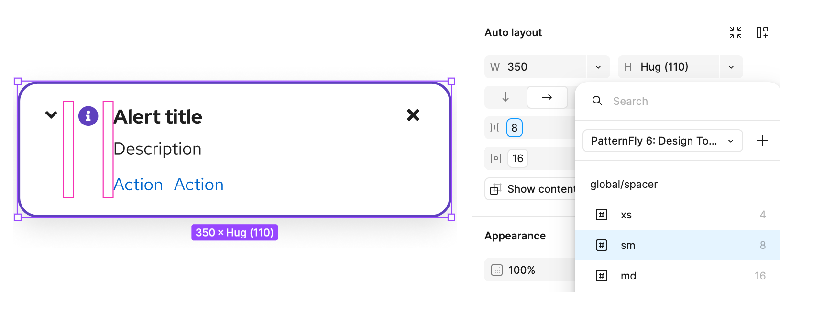

import './spacers.css';

PatternFly designs use **spacers** to define fixed amounts of space between UI elements. They help you create designs that are visually balanced and consistent. Spacers are built into PatternFly components, and are also available as tokens for you to use within Figma's auto layout system:

## Spacer sizing 

Like the rest of our dimension tokens, spacers use rem sizing, rather than pixels. Rems are relative units that adjust size based on a webpage's HTML document root element size. For example, if the root size is 10px, a rem size of 1.5 would be 15px.

PatternFly's default root element size is 16px. If you change this default size, note that the following table will no longer show accurate pixel measurements (though the rem values will stay the same).
## PatternFly spacers 

Our spacers include the following sizes:

| **Spacer** | **Token** | **Size** | **Example** | 
| :-:| :-: | :-: | :-: |
| xs | `--pf-t--global--spacer--xs` | .25rem (4px) | 

 | 
|  sm | `--pf-t--global--spacer--sm` | .5rem (8px) |

 |
|  md | `--pf-t--global--spacer--md` | 1rem (16px) |

 | 
|  lg | `--pf-t--global--spacer--lg` | 1.5rem (244px) |

 |
|  xl | `--pf-t--global--spacer--xl` | 2rem (32px) |

 |
|  2xl | `--pf-t--global--spacer--2xl` | 3rem (48px) | 

 |
|  3xl | `--pf-t--global--spacer--3xl` | 4rem (64px) | 

 |
 | 4xl | `--pf-t--global--spacer--4xl` | 5rem (80px) | 

Spacer tokens are based on the values in the previous table, but there are certain use cases that align with more specific tokens. When using spacers in these scenarios, always use these more specific semantic tokens, rather than a global spacer token. 
- **Action spacers:** Used to set horizontal and vertical padding within actions, like buttons. 
  - Action spacer tokens begin with `--pf-t--global--spacer--action--`.
- **Control spacers:** Used to set horizontal and vertical padding within controls, like menu toggles and text inputs. 
  - Control spacer tokens begin with `--pf-t--global--spacer--control--`.
- **Gap spacers:** Used to set space between elements or groups of elements, like gaps between multiple actions, gaps between items in a group, gaps between controls, and so on. 
  - Gap spacer tokens begin with `--pf-t--global--spacer--gap`. 

You can search for spacer tokens in [our list of all tokens.](/tokens/all-patternfly-tokens)
## Considering line height and padding

There are additional considerations to keep in mind when adapting spacers to different line heights and padding, which are common with PatternFly components and text content.

### Using spacers with components

Some components like icons, buttons, and input fields, have a fixed amount of padding built in. Remember to account for this extra space when laying the content out on your page. You may not have as much horizontal or vertical room as you think.

### Using spacers with text 

When using spacers with text-based content, you should consider line height to ensure that you’re leaving the right amount of vertical space between each line of text. 

  

    

      Design is a journey of discovery
    

    

    

    

  Body text should be Red Hat Text at 16px. It should have 24px of lead space because of its relative line height of 1.5.
    

  

You also need to use different spacer sizes depending on the type of text you’re using. For example, you’ll need to provide a 16px spacer between a title and body copy, but only an 8px spacer between items in a bulleted or numbered list.

  

    

      Design is a journey of discovery
    

    

    

    

      Body text should be Red Hat Text at 16px. It should have 24px of leading because of its relative line height of 1.5.
    

    

    

    

      Design is a journey of discovery
    

    

    

    

      Body text should be Red Hat Text at 16px. It should have 24px of leading because of its relative line height of 1.5.
    

    

    

    

      1. Lists should use body text style with 8px between items.
    

    

    

    

      2. This is the second item in the list.
    

    

    

    

      a. Secondary items in the list should use 8px spacing.
    

    

    

    

      b. They still use the same text styling, however.
    

  

For more information about line height and typography, read our [typography guidelines.](/design-foundations/typography)

