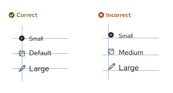

import { Icon, Content, ContentVariants } from '@patternfly/react-core';
import RhUiCheckCircleFillIcon from '@patternfly/react-icons/dist/esm/icons/rh-ui-check-circle-fill-icon';
import RhUiErrorFillIcon from '@patternfly/react-icons/dist/esm/icons/rh-ui-error-fill-icon';
import RhUiWarningFillIcon from '@patternfly/react-icons/dist/esm/icons/rh-ui-warning-fill-icon';
import RhUiInformationFillIcon from '@patternfly/react-icons/dist/esm/icons/rh-ui-information-fill-icon';
import RhUiNotificationFillIcon from '@patternfly/react-icons/dist/esm/icons/rh-ui-notification-fill-icon';
import RhUiStarIcon from '@patternfly/react-icons/dist/esm/icons/rh-ui-star-icon';
import { IconsTable } from './IconsTable.jsx';
import './icons.css';

If you're a developer, check out our [development onboarding guide](/get-started/develop#using-icons) to learn how to install and use our icon set.

For React and HTML implementation examples, [refer to the icon component pages.](/components/icon)

## Icon sizes

Icon size tokens use rems, rather than pixels. Rems are relative units that adjust font size based on a webpage's HTML document root element size. For example, if the root size is 10px, a rem size of 1.5 would be 15px.

PatternFly's default root element size is 16px. If you change this default size, note that the following tables will no longer show accurate pixel measurements (though the rem values will stay the same). 

## Inline icons

[Inline icons](/components/icon#inline) must be center-aligned horizontally when placed next to text and center-aligned vertically when stacked.

Use the following semantic tokens to ensure that icons are properly aligned and match the correct font size:

### Headings 

| **Size** | **Token** | **Example** |
| --- | --- | :---: |
|  1.375rem (22px)   | `pf-t--global--icon--size--font--heading--h1` | <Content component="h1"> <Icon isInline> <RhUiStarIcon /> </Icon> Heading <Icon isInline> <RhUiStarIcon /> </Icon></Content>  | 
| 1.25rem (20px)    | `pf-t--global--icon--size--font--heading--h2` | <Content component="h2"> <Icon isInline> <RhUiStarIcon /> </Icon> Heading <Icon isInline> <RhUiStarIcon /> </Icon></Content>  |
| 1.125rem (18px) | `pf-t--global--icon--size--font--heading--h3` | <Content component="h3"> <Icon isInline> <RhUiStarIcon /> </Icon> Heading <Icon isInline> <RhUiStarIcon /> </Icon></Content>  |
| 1rem (16px) | `pf-t--global--icon--size--font--heading--h4` | <Content component="h4"> <Icon isInline> <RhUiStarIcon /> </Icon> Heading <Icon isInline> <RhUiStarIcon /> </Icon></Content>  |
| 1rem (16px) | `pf-t--global--icon--size--font--heading--h5` | <Content component="h5"> <Icon isInline> <RhUiStarIcon /> </Icon> Heading <Icon isInline> <RhUiStarIcon /> </Icon></Content>  |
| 1rem (16px) | `pf-t--global--icon--size--font--heading--h6` | <Content component="h6"> <Icon isInline> <RhUiStarIcon /> </Icon> Heading <Icon isInline> <RhUiStarIcon /> </Icon></Content>  |

### Body text

| **Size** | **Token** | **Example** |
| --- | --- | :---: |
| 0.75rem (12px)  | `pf-t--global--icon--size--font--body--sm`  | <Content component={ContentVariants.small}> <Icon isInline><RhUiStarIcon /></Icon> Small body <Icon isInline><RhUiStarIcon /></Icon></Content> |
| 0.875rem (14px) | `pf-t--global--icon--size--font--body--default`  | <Content component={ContentVariants.p}> <Icon isInline><RhUiStarIcon /></Icon> Default body <Icon isInline><RhUiStarIcon /></Icon></Content> 
| 1rem (16px)  | `pf-t--global--icon--size--font--body--lg`  | <Content component={ContentVariants.p} style="font-size: 16px"> <Icon isInline><RhUiStarIcon /></Icon> Large body <Icon isInline><RhUiStarIcon /></Icon></Content> 

## Standalone icons 

Occasionally, you may need to use a standalone icon that isn't aligned with any kind of text. PatternFly supports a range of icon sizes that can adapt to these use cases, including small, medium, large, x-large, 2xl, and 3xl icons. These sizes correspond to the following font sizes and tokens:

| **Size** | **Token** | **Example** |
| --- | --- | :---: |
| Small (0.75rem, 12px) |  `--pf-t--global--icon--size--sm` |<Icon size ="sm"><RhUiStarIcon /></Icon> |
| Medium (0.875rem, 14px) |  `--pf-t--global--icon--size--md` |<Icon size ="md"><RhUiStarIcon /></Icon> |
| Large (1rem, 16px) |  `--pf-t--global--icon--size--lg` |<Icon size ="lg"><RhUiStarIcon /></Icon> |
| X-large (1.375rem, 22px) | `--pf-t--global--icon--size--xl` | <Icon size ="xl"> <RhUiStarIcon /></Icon> |
| 2xl (3.5rem, 56px) | `--pf-t--global--icon--size--2xl` |  <Icon size ="2xl"><RhUiStarIcon /></Icon> |
| 3xl (6rem, 96px) | `--pf-t--global--icon--size--3xl` | <Icon size ="3xl"><RhUiStarIcon /></Icon> |

Medium icons are typically the most versatile size to use in a UI. Most icons in PatternFly components are medium; other sizes are used sparingly.

## Icon colors
All icon colors that you use should align with the proper [semantic design token.](/foundations-and-styles/design-tokens/all-design-tokens) For example, a warning icon should use our approved warning color, a danger icon should use our approved danger color, and so on. 

| **Icon state** | **Color token** | **Example** |
| --- | --- | :---: |
| Danger | `--pf-t--global--icon--color--status--danger--default` | <Icon status="danger" size="xl"> <RhUiErrorFillIcon /> </Icon> |
| Warning  | `--pf-t--global--icon--color--status--warning--default` | <Icon status="warning" size="xl"><RhUiWarningFillIcon /></Icon> |
| Success | `--pf-t--global--icon--color--status--success--default` | <Icon status="success" size="xl"><RhUiCheckCircleFillIcon /></Icon> |
| Info | `--pf-t--global--icon--color--status--info--default` | <Icon status="info" size="xl"><RhUiInformationFillIcon /></Icon> |
| Custom | `--pf-t--global--icon--color--status--custom--default` | <Icon status="custom" size="xl"><RhUiNotificationFillIcon /></Icon> |

To learn more about icon colors and color tokens, visit our [colors page.](/foundations-and-styles/colors) 

## PatternFly icons
We use <a href="https://www.redhat.com/en/about/brand/standards/icons">Red Hat brand UI icons</a> (`rh-ui-*`), delivered through `@patternfly/react-icons` and the [icon component](/components/icon). The following table lists the icons we document for use in PatternFly UIs.

Use the [React Icon component](/components/icon) with imports from `@patternfly/react-icons`, or inline SVG from your product’s PatternFly assets. For setup details, see the [development onboarding guide](/get-started/develop#using-icons).

### React icons
Import icons from our [react-icons package](https://www.npmjs.com/package/@patternfly/react-icons):

`import { [insert-icon-name] } from '@patternfly/react-icons/dist/esm/icons/[insert-hyphenated-icon-name]';`

For example:

`import RhUiStarIcon from '@patternfly/react-icons/dist/esm/icons/rh-ui-star-icon';`

## All icons 

The following table lists Red Hat UI icons with usage guidance for PatternFly.

For guidance related to icon tooltips, [refer to our tooltips writing guide.](/content-design/writing-guides/tooltips#icon-tooltips)

Select any single icon in the table to download it as an SVG.

<IconsTable />
