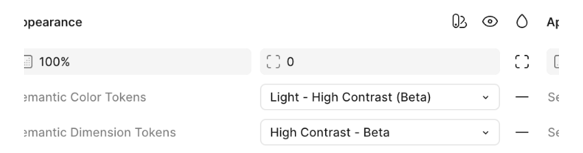

import '../../../components/components.css'
import { Alert, AlertActionLink} from '@patternfly/react-core';
import ExternalLinkAltIcon from '@patternfly/react-icons/dist/esm/icons/external-link-alt-icon';

A **theme** applies specific visual styles to UI components to create a unique, cohesive, and purposeful look. Our theming architecture leverages [our design token system](/foundations-and-styles/design-tokens/overview) to flexibly support different brand identities, user preferences, and accessibility needs. 

## Theming architecture 

We utilize a tiered theming architecture to consistently manage the appearance of UIs:
- **Theme:** Defines the foundational brand appearance, including core colors, border radii, iconography, and assets.
- **Color scheme:** Controls the brightness and palette shifts between light and dark environments.
- **Contrast mode:** Adjusts the style of surfaces and elements for specific aesthetic or accessibility needs.

## Themes

We support 2 pre-built themes in PatternFly. While the visual identity of each theme differs, they share the same underlying interaction patterns and accessibility standards.

### Default theme

The Default theme creates the standard, open source PatternFly experience. It is characterized by blue branding, modern, square borders, and simple icons. 

### Unified theme

The Unified theme is designed for products within the Red Hat portfolio, providing closer alignment with the [Red Hat Design System](https://ux.redhat.com/). It is characterized by red accent colors, smooth, rounded borderds, Red Hat icons, and glass contrast mode. Core interactive elements, such as primary buttons, continue to use blue for usability.

For implementation guidance, refer to the Unified theme handbook.

For a detailed look at the design philosophy and research behind the Unified theme, check out our Medium article: Title.

### Custom themes 

To branch off of our themes and create your own, you can identify the design tokens you'd like to adjust on our [all tokens page](/foundations-and-styles/design-tokens/all-design-tokens) and provide new values to use within your application. 

#### When to customize a theme

There are a couple of instances when you might want to adjust an existing PatternFly theme: 
- One-off adjustments, like changing a single button color, spacer, or font size, when intentional deviation is needed across your product. 
- Application-wide adjustments, like changing all button colors and font sizes to adjust the overall brand identity of your product. 

## Color schemes 

### Light mode

Light mode is the standard appearance for most web environments. 
 
Light mode places dark text on light backgrounds, while maintaining a [text contrast ratio of at least 4.5:1](https://www.w3.org/WAI/WCAG22/quickref/?versions=2.1#contrast-minimum) and a [non-text contrast ratio of at least 3:1](https://www.w3.org/WAI/WCAG22/quickref/?versions=2.1#non-text-contrast). Some users might find light screens easier to read, while others might simply prefer the appearance.

### Dark mode

Dark mode adapts color palettes for light-sensitive users or low-light environments. It presents light text on dark backgrounds backgrounds while maintaining the same accessibility ratios as light mode. Some users might prefer dark mode for aesthetics, while others find it to be easier on the eyes and less straining for those with light sensitivities. 

For implementation guidance, refer to the [dark theme handbook](/foundations-and-styles/theming/dark-theme-handbook).

## Contrast modes

Contrast modes adjust the surface treatment of UI elements across both color schemes. They are mutually exclusive and can't be applied simultaneously.

### High contrast

High contrast mode is focused on improving accessibility for users who require more clarity and higher contrast between UI elements. Turned on by user preference, high contrast mode adjusts border strokes and colors to meet an [enhanced contrast ratio of at least 7:1](https://www.w3.org/WAI/WCAG21/Understanding/contrast-enhanced.html). 

**Note:** Activating high contrast mode will override and disable glass mode to ensure all boundaries and text meet strict accessibility requirements.

For implementation guidance, refer to the [high contrast handbook](/foundations-and-styles/theming/high-contrast-handbook).

### Glass

Glass mode introduces transparency and depth to the UI, creating a layered visual effect. It is enabled in the Unified theme by default, but can also be manually enabled in the Default theme.

When glass is enabled, the following changes will apply:
- **Transparency:** Container backgrounds will become more transparent, allowing the content below to subtly show through.  
- **Background image:** A pre-approved background image will fill the page body. Product teams must work with the Brand team ensure these images maintain accessibility compliance behind UI elements.
- **Layout changes:** Layout variations, including the banded masthead and floating side navigation.

For implementation guidance, refer to the glass handbook.

## Feature compatibility 

The following table outlines the availability and compatibility of PatternFly features across themes. 

| Feature | Default theme | Unified theme |
| --- | --- | --- | 
| Accent color | Blue | Red | 
| Interactive element colors | Blue | Blue | 
| Border radius shape | Square | Pill | 
| Default contrast mode | Standard | Glass | 
| Background image | Optional (Manual) | Required (with glass mode) |
| Branded icons | Optional (Manual) | Default
| High contrast support | Yes | Yes |

## Using themes in Figma

Our Figma libraries fully support theming. Designers can create a single design and then swap between our themes using the "Apply Variable Mode" toggles in the "Appearance" section of the component properties panel. This makes it easy to visually test and validate designs across all supported themes.

The standard light PatternFly theme will be applied to components by default. If you want your mockups to use our dark or high contrast themes, you will need to adjust the following settings in Figma. 

### Unified theme

To swap between the Default and Unified themes, adjust the themevariable mode. The Unified mode will automatically apply the red accents, pill shapes, and glass treatment.

### Dark mode

To swap your components to our standard dark mode, change the Semantic Color Tokens variable mode to be "Dark":

### High contrast mode

To swap your components to our high contrast mode, change the Semantic Dimension Tokens variable mode to be "High Contrast" and choose either "Light - High Contrast" or "Dark - High Contrast" for the Semantic Color Tokens variable mode:

### Chart themes

Our charts use a unique token collection, so you will need to adjust chart variable modes separately from components in order to swap themes. To change the variable mode for charts, follow the same steps previously outlined for component theme adjustments. 

## Best practices

To ensure your application is robust, maintainable, and adaptable across different themes, we recommend following these best practices.

- **Use default PatternFly components:** Whenever possible, use PatternFly components as they are. This ensures you stay up-to-date with our intended design, functionality, and accessibility standards. It also makes upgrades more seamless, decreases development time, and guarantees consistency across applications.
- **Use design tokens and variables for customizations:** If you must customize a component, use the appropriate method:
    - **Design tokens:** For global changes
    - **Component variables:** For component-specific changes
    - Example: To override a primary button’s background color, declare `.pf-v6-c-button { --pf-v6-c-button--m-primary--BackgroundColor: [color token]; }` instead of `.pf-v6-c-button.pf-m-primary { background-color: [color token]; }`.
- **Always use tokens to create custom styles:** When creating custom components or styles, never use hard-coded values like hex codes or color names (`#fff` or `white`). Instead, use the appropriate design token, such as `var(--pf-t--global--background--color--primary--default)`. Tokens automatically adapt to different themes, while hard-coded values do not.
- **Prioritize semantic tokens:** Always use the most relevant semantic token for your use case to ensure the element's purpose is clear and that it receives the correct styling in any theme. If no semantic token exists, you can fall back to a base token. 
- **Never use a palette token**: Do not use palette tokens (like `--pf-t--color--blue--20`) directly in your code, as the value is not guaranteed to be consistent across themes.
- **Use scalable icons:** For icons, use vector images (SVG) or icon fonts instead of raster or bitmap images (PNG, JPEG, GIF, BMP, and so on). This allows you to control their color with CSS `fill` and `color` properties. By assigning a design token to these properties, your icons will automatically change color to match the active theme.
    - If you must use static images, you might need to hide and show different image files based presence of a theme-specific class (like `pf-v6-theme-dark`).